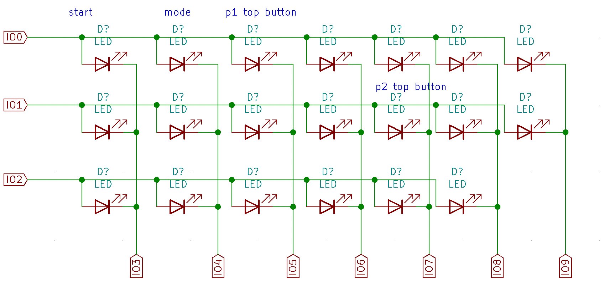

# Pico Light Arcade

This is the code for the Pico Light Arcade game that can be seen here:
https://twitter.com/ghidraninja/status/1422900329369178113

## Hardware setup

The LEDs and buttons are connected in a 3x7 matrix. Pictures will follow shortly :)

### Required materials

- A board (duh!)
- 20 arcade buttons (note that most of them are really dark at 3.3V, you might want to change the resistor!)
- Blade receptables
- Wire
- A Raspberry Pi Pico

### LEDS

The anode is the Y axis, and gets connected to IO 0, 1 and 2.

The cathode is the X axis of the matrix and gets connected to IOs 3-9.

### Buttons

The buttons' matrix Y axis is connected to IO 10-12, the X axis to IO 13-19.

### LED/Button schematic

This is how the LEDs & Buttons neeed to be connected (With Buttons starting from IO10 instead of IO0):



## Building the firmware

```
export  PICO_SDK_PATH=path-to-sdk
mkdir build
cd build
cmake ..
make
```

## Running the webinterface

Note that you'll need a self-signed cert + key for running locally, as browsers only allow Web Serial via HTTPS.

```
cd web
npm install
HTTPS=true SSL_CRT_FILE=cert.pem SSL_KEY_FILE=keynp.pem npm start
```
